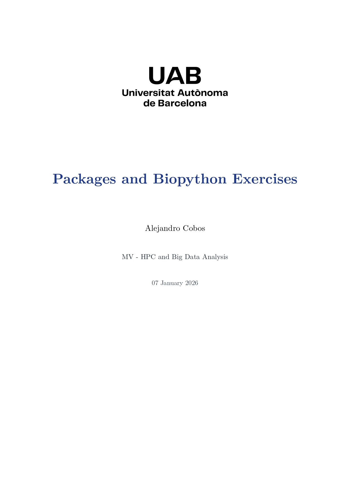
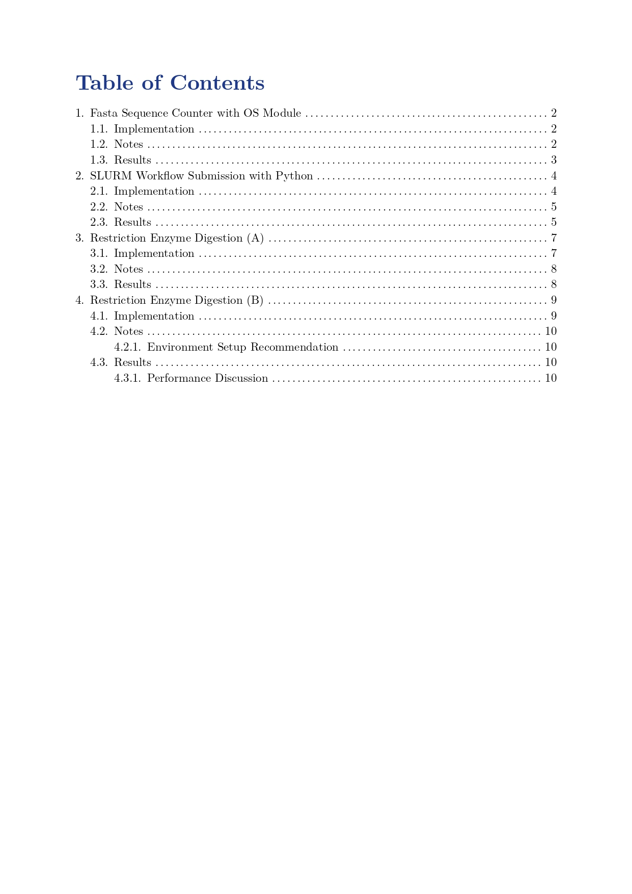
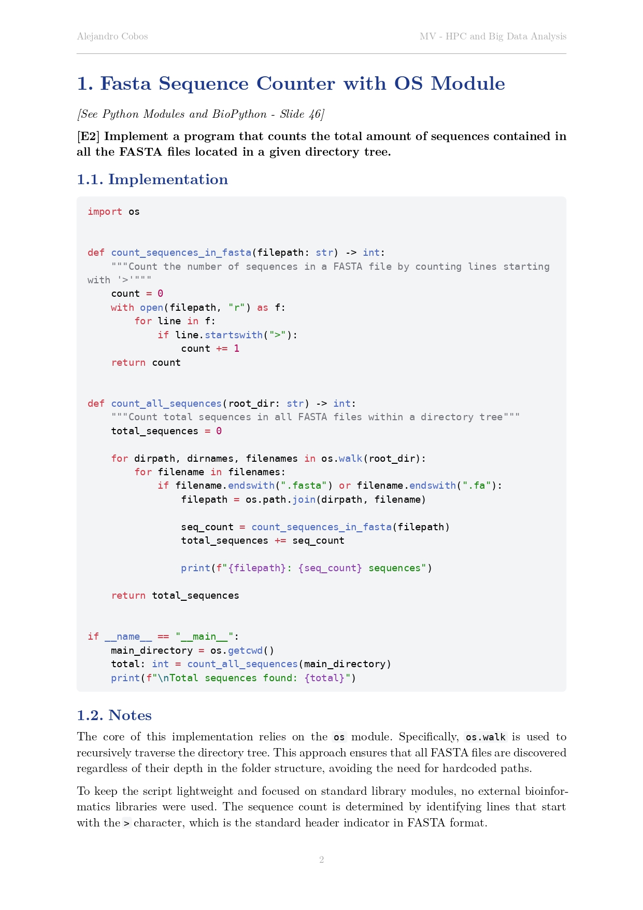
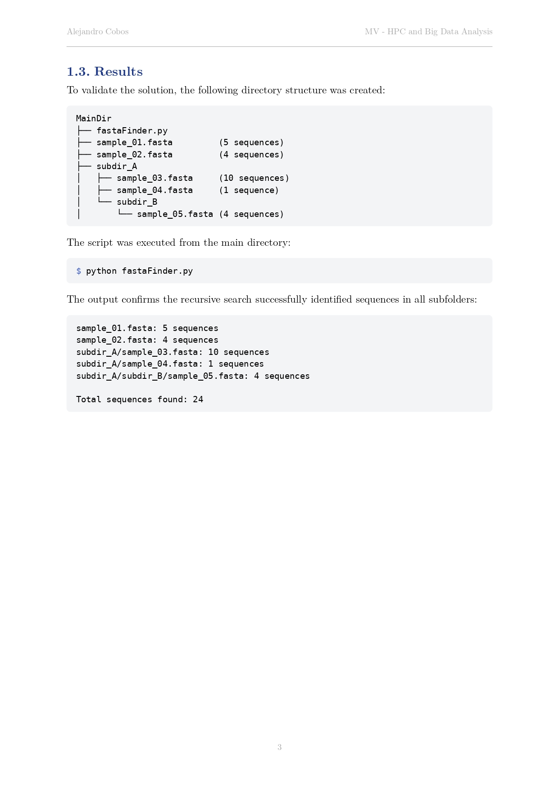

# Typst Academic Template

A clean and simple Typst template for academic reports and assignments with automatic formatting, headers, and citation support.


## Features

✨ **Clean Title Page** with customizable logo, title, author, course, and date  
📑 **Optional Table of Contents** on a separate page  
📝 **Numbered Headings** with navy blue styling (4 levels)  
📊 **Figure & Table Support** with automatic captions and numbering  
💻 **Syntax-Highlighted Code Blocks** with light background  
📚 **APA Bibliography** integration with `.bib` files  
🔗 **Smart Cross-References** - Figures display as "Fig. X"  
📄 **Auto Headers/Footers** - Author and course in header, page numbers in footer  
🎨 **Customizable** - Adjust styling and toggle table of contents  
🖼️ **Default Placeholder Logo** included - replace with your own

## Preview

| | |
|-|-|
|  |  |
|  |  |

[View Full Example PDF](https://github.com/Cobos-Bioinfo/Typst-Report-Template/blob/main/Demo/report-preview.pdf)

## Prerequisites

Before installing this template, you need to have Typst installed on your machine.

**Install Typst**: Visit the [official Typst installation page](https://github.com/typst/typst#installation) and follow the instructions for your operating system.

## Installation

### Option 1: Manual Installation

1. **Create the necessary directories** for Typst local packages:

   **Windows**:
```
   C:\Users\YourUsername\AppData\Roaming\typst\packages\local\academic-template\0.1.0
```

   **macOS/Linux**:
```
   ~/.local/share/typst/packages/local/academic-template/0.1.0
```

   > **NOTE:** You may need to create the `typst`, `packages`, `local`, `academic-template`, and `0.1.0` folders if they don't exist.

2. **Download this repository** (click the green "Code" button → "Download ZIP") or clone it

3. **Copy the following files** into the `0.1.0` folder you just created:
   - `main.typ` (the template file)
   - `typst.toml` (package configuration)
   - `assets/` folder (contains the default placeholder logo)

4. **Your final structure should look like this**:
```
   typst/packages/local/academic-template/0.1.0/
   ├── main.typ
   ├── typst.toml
   └── assets/
       └── logoipsum-404.svg  # Default placeholder logo
```

5. **Done!** You can now import the template in any Typst project using:
```typst
   #import "@local/academic-template:0.1.0": report
```

### Option 2: Git Clone

If you're comfortable with Git, you can clone directly into the local packages directory:

**macOS/Linux**:
```bash
git clone https://github.com/Cobos-Bioinfo/Typst-Report-Template.git \
  ~/.local/share/typst/packages/local/academic-template/0.1.0
```

**Windows (PowerShell)**:
```powershell
git clone https://github.com/Cobos-Bioinfo/Typst-Report-Template.git `
  "$env:APPDATA\typst\packages\local\academic-template\0.1.0"
```

### Option 3: Use Directly in a Project (No Installation)

If you don't want to install the template globally, copy the repository into your project:
```
my-report/
├── report.typ
└── academic-template/
    ├── main.typ
    ├── typst.toml
    └── assets/
```
Then import it using a relative path:
```typst
#import "academic-template/main.typ": report
```

## Usage

### Minimal Example
```typst
#import "@local/academic-template:0.1.0": report

#show: report.with(
  title: "Lab Report 1",
  course: "BIOL 301",
  author: "Jane Smith",
)

= Introduction
Your content starts here.
```

### Full Example (Custom Logo, TOC, Bibliography)
```typst
#import "@local/academic-template:0.1.0": report

#show: report.with(
  title: "Comprehensive Analysis of Machine Learning in Genomics",
  course: "CS 589 - Bioinformatics",
  author: "John Doe",
  logo: image("my-university-logo.png"),  // Replace default logo
  show-toc: true,
  bibliography-file: bibliography(
    "references.bib",
    title: "References",
    style: "apa",
  ),
)

= Introduction
Recent advances @smith2024 have shown...

= Methods
== Data Collection
== Analysis

= Results
See @fig:results for details.

#figure(
  image("results.png", width: 80%),
  caption: [Experimental results],
) <fig:results>

= Discussion
= Conclusion
```

### Using Citations

To use citations in your document:

1. **Create a `.bib` file** (e.g., `references.bib`) in the same directory as your document:
```bibtex
   @article{smith2024,
     author  = {John Smith and Emily Johnson},
     title   = {Artificial Intelligence in Modern Healthcare},
     journal = {Journal of Medical Systems},
     year    = {2024},
     volume  = {48},
     pages   = {1--15},
   }
```

2. **Load the bibliography** in your template configuration:
```typst
   #show: report.with(
     // ... other parameters
     bibliography-file: bibliography(
       "references.bib",
       title: "References",  // Optional: customize title
       style: "apa",         // Options: "apa", "ieee", "chicago-notes", etc.
     ),
   )
```

3. **Cite in your text** using `@` followed by the citation key:
```typst
   Recent research @smith2024 has demonstrated...
```

The bibliography will automatically appear at the end of your document.

### Customizing the Logo

The template includes a placeholder logo by default. To use your own:

**Option 1 - Override in your document** (recommended):
```typst
#show: report.with(
  logo: image("path/to/your-logo.png"),  // or .svg, .jpg
  // ... other parameters
)
```

**Option 2 - Replace the default in the template**:
Navigate to the template installation and replace `assets/logoipsum-404.svg` with your logo file.

**Option 3 - Disable the logo**:
```typst
#show: report.with(
  logo: none,  // No logo on title page
  // ... other parameters
)
```

## Parameters

| Parameter | Type | Default | Description |
|-----------|------|---------|-------------|
| `title` | string | `"Report Title"` | Main document title |
| `course` | string | `"Course Module"` | Course or module name (appears in header) |
| `author` | string | `"Your Name"` | Author name (appears in header) |
| `logo` | content/none | `image("assets/logoipsum-404.svg")` | Logo on title page (use `image("path")` to customize or `none` to disable) |
| `show-toc` | boolean | `false` | Show table of contents on separate page |
| `bibliography-file` | content/none | `none` | Bibliography (use `bibliography("file.bib", title: "References", style: "apa")` to load) |

## Styling Details

### Headings
- **Level 1**: 18pt, bold, navy blue (#1e3a8a)
- **Level 2**: 14pt, bold, navy blue
- **Level 3**: 12pt, bold, navy blue
- **Level 4**: 11pt, bold, navy blue

All headings are numbered (e.g., 1., 1.1., 1.1.1.)

### Layout
- **Paper**: A4
- **Margins**: 2.5cm all sides
- **Font**: New Computer Modern (similar to Times New Roman), 11pt
- **Paragraph**: Justified with 0.65em leading

### Code Blocks
- Light gray background (#f3f4f6)
- 9pt font size
- Rounded corners
- Syntax highlighting support

### Figures & Tables
- Centered alignment
- Automatic numbering
- Figure references display as "Fig. X" instead of "Figure X"

## File Structure Example
```
my-report/
├── report.typ           # Your main document
├── references.bib       # Bibliography file
├── logo.png             # Your custom logo (optional)
└── images/
    ├── chart1.png
    └── diagram.svg
```

## Requirements

- Typst 0.12.0 or later
- Works with Typst CLI, Typst web app, and VS Code Typst extension

## Contributing

Contributions are welcome! Feel free to:
- Report bugs or issues
- Suggest new features
- Submit pull requests

## License

MIT License - See [LICENSE](LICENSE) file for details

## Author

**Alejandro Cobos**
- GitHub: [@Cobos-Bioinfo](https://github.com/Cobos-Bioinfo)
- LinkedIn: [Alejandro Cobos Filloy](https://www.linkedin.com/in/acobos-bioinformatics/)

## Acknowledgments

Built with [Typst](https://typst.app/) - A modern alternative to LaTeX

---

⭐ If you find this template useful, please consider giving it a star!